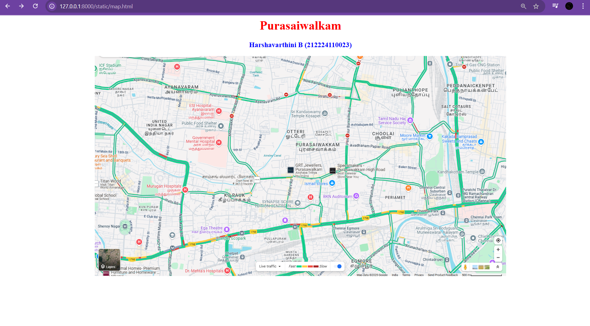
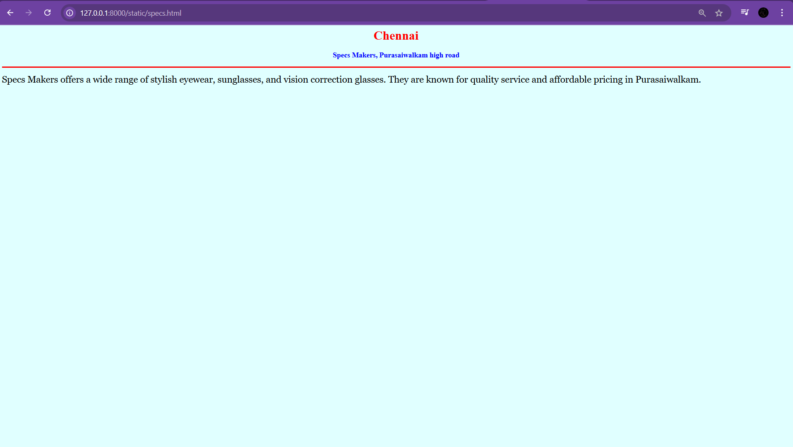
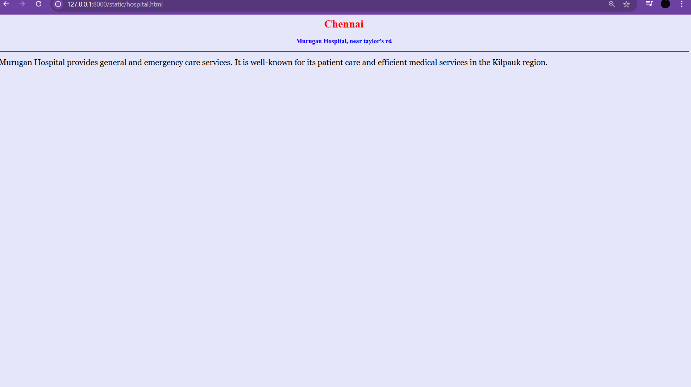
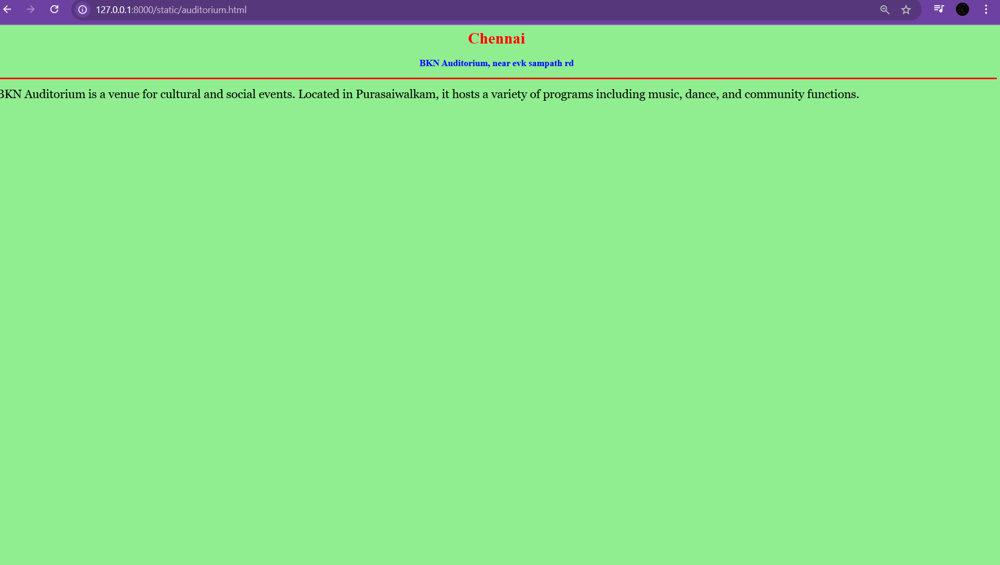
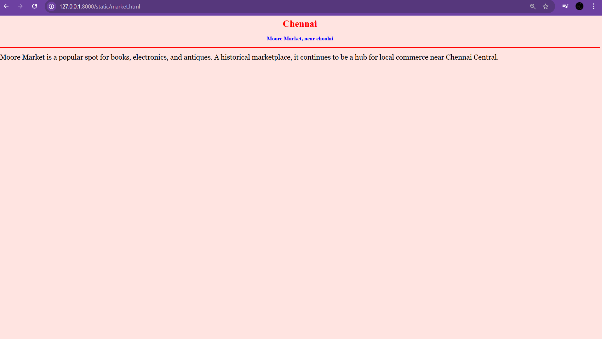

# Ex04 Places Around Me

## Date: 02.04.2025

## AIM
To develop a website to display details about the places around my house.

## DESIGN STEPS

### STEP 1
Create a Django admin interface.

### STEP 2
Download your city map from Google.

### STEP 3
Using ```<map>``` tag name the map.

### STEP 4
Create clickable regions in the image using ```<area>``` tag.

### STEP 5
Write HTML programs for all the regions identified.

### STEP 6
Execute the programs and publish them.

## CODE
~~~
<html>
<head>
    <title>My City</title>
</head>
<body>
    <h1 align="center"><font color="red"><b>Purasaiwalkam</b></font></h1>
    <h3 align="center"><font color="blue"><b>Harshavarthini B (212224110023)</b></font></h3>

    <center>
        
        <map name="MyCity">
            <area shape="circle" coords="510,240,30" href="grt.html" title="GRT Jewellers">
            <area shape="circle" coords="570,255,30" href="specs.html" title="Specs Makers">
            <area shape="circle" coords="450,320,30" href="hospital.html" title="Murugan Hospital">
            <area shape="circle" coords="600,320,30" href="auditorium.html" title="BKN Auditorium">
            <area shape="circle" coords="640,360,30" href="market.html" title="Moore Market">
        </map>
    </center>
</body>
</html>
~~~
~~~
home.html
<html>
<head>
    <title>GRT Jewellers</title>
</head>
<body bgcolor="lightyellow">
    <h1 align="center"><font color="red"><b>Chennai</b></font></h1>
    <h3 align="center"><font color="blue"><b>GRT Jewellers, Purasaiwalkam</b></font></h3>
    <hr size="3" color="red">
    <p align="justify"><font face="Georgia" size="5">
        GRT Jewellers in Purasaiwalkam is known for its exquisite gold and diamond jewellery collections. A popular destination for traditional and contemporary ornaments in Chennai.
    </font></p>
</body>
</html>
~~~
~~~
specs.html
<html>
<head>
    <title>Specs Makers</title>
</head>
<body bgcolor="lightcyan">
    <h1 align="center"><font color="red"><b>Chennai</b></font></h1>
    <h3 align="center"><font color="blue"><b>Specs Makers, Purasaiwalkam high road</b></font></h3>
    <hr size="3" color="red">
    <p align="justify"><font face="Georgia" size="5">
        Specs Makers offers a wide range of stylish eyewear, sunglasses, and vision correction glasses. They are known for quality service and affordable pricing in Purasaiwalkam.
    </font></p>
</body>
</html>
~~~
~~~
hospital.html
<html>
<head>
    <title>Murugan Hospital</title>
</head>
<body bgcolor="lavender">
    <h1 align="center"><font color="red"><b>Chennai</b></font></h1>
    <h3 align="center"><font color="blue"><b>Murugan Hospital, near taylor's rd</b></font></h3>
    <hr size="3" color="red">
    <p align="justify"><font face="Georgia" size="5">
        Murugan Hospital provides general and emergency care services. It is well-known for its patient care and efficient medical services in the Kilpauk region.
    </font></p>
</body>
</html>
~~~
~~~
auditorium.html
<html>
<head>
    <title>BKN Auditorium</title>
</head>
<body bgcolor="lightgreen">
    <h1 align="center"><font color="red"><b>Chennai</b></font></h1>
    <h3 align="center"><font color="blue"><b>BKN Auditorium, near evk sampath rd</b></font></h3>
    <hr size="3" color="red">
    <p align="justify"><font face="Georgia" size="5">
        BKN Auditorium is a venue for cultural and social events. Located in Purasaiwalkam, it hosts a variety of programs including music, dance, and community functions.
    </font></p>
</body>
</html>
~~~
~~~
market.html
<html>
<head>
    <title>Moore Market</title>
</head>
<body bgcolor="mistyrose">
    <h1 align="center"><font color="red"><b>Chennai</b></font></h1>
    <h3 align="center"><font color="blue"><b>Moore Market, near choolai</b></font></h3>
    <hr size="3" color="red">
    <p align="justify"><font face="Georgia" size="5">
        Moore Market is a popular spot for books, electronics, and antiques. A historical marketplace, it continues to be a hub for local commerce near Chennai Central.
    </font></p>
</body>
</html>
~~~

## OUTPUT






## RESULT
The program for implementing image maps using HTML is executed successfully.
